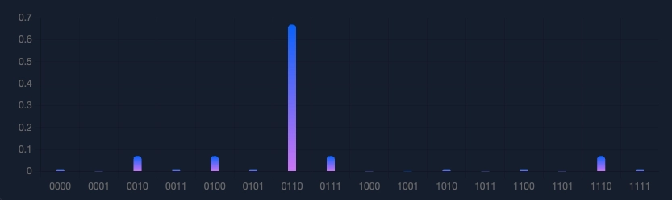

# Peaked Circuits

**Peaked circuits** are pre-constructed quantum circuits with a non-uniform measurement distribution. They are designed so that one specific bitstring has significantly higher probability (for example, `O(1)`) than typical alternatives with exponentially small probability.

They were introduced by [Scott Aaronson](https://doi.org/10.48550/arXiv.2404.14493) as a path toward verifiable quantum advantage. Well-designed peaked circuits can look random, similar to circuits used in quantum supremacy-style benchmarks, but they are far easier to verify: run the circuit and check whether the hidden peak bitstring appears at the expected elevated rate.

## History of Developments

- April 2024: Scott Aaronson and Yuxuan Zhang introduced peaked circuits as a benchmark class for quantum computers.
- April 2025: The first Peaked Circuits Hackathon took place at Yale.
- January 2026: BlueQubit introduced HQAP circuits ([Heuristic Quantum Advantage with Peaked Circuits](https://doi.org/10.48550/arXiv.2510.25838)).

## How Peaked Circuits Work
Peaked circuits are expressed in OpenQASM ([`.qasm` format](https://en.wikipedia.org/wiki/OpenQASM)). Each circuit prepares a quantum state with one hidden bitstring that is intentionally more likely to be measured.



In the example above, `0110` is the peak bitstring because it has much higher measurement probability than the other outcomes.

Example circuit:

```qasm
OPENQASM 2.0;
include "qelib1.inc";
qreg q[4];
x q[1];
x q[2];
ry(0.8*pi) q[0];
ry(0.8*pi) q[1];
ry(0.8*pi) q[2];
ry(0.8*pi) q[3];
```

## Development Setup

1. Clone the repository.

```bash
gh repo clone roman-bagdasarian/Peaked-Circuits
```

2. Create the Conda environment.

```bash
conda env create -f environment.yml
```

3. Activate the environment.

```bash
conda activate pc
```

4. Run the sample script.

```bash
python sample.py
```

5. Expected output: 1001

## Preprocessing and Simulation

Most scripts use the following command pattern:

```bash
python <SCRIPT_NAME>.py <PATH_TO_QASM>
```

### Circuit Characteristics

Inspect circuit parameters.

```bash
python characteristics.py data\Yale_Quantum_2025\P1_little_peak.qasm
```

### Preprocessing Methods

Preprocess circuits to lower complexity (for example, reducing gate count and interconnectivity). In the order of simplicity:

1. transpilation
2. separation
3. zx-calculus

```bash
python zx-calculus.py data\Yale_Quantum_2025\P1_little_peak.qasm
```

### Simulation Methods

- statevector
	- Runs circuits locally.
	- Up to 29 qubits with --method statevector.
	- For larger circuits, use --method matrix_product_state (accuracy/time depends on max bond dimension).

```bash
python statevector.py --method matrix_product_state --bond_dim 64 data\Yale_Quantum_2025\P1_little_peak.qasm
```

- bluequbit_cpu
	- Runs circuits through the BlueQubit API.
	- Supports up to 34 qubits.
	- Use --device cpu (Google statevector backend) or --device mps.cpu.

```bash
python bluequbit_cpu.py --id <YOUR_API_KEY> --device mps.cpu --bond_dim 64 data\Yale_Quantum_2025\P1_little_peak.qasm
```

## Data

For many BlueQubit-provided challenge circuits, the correct peak bitstring is unknown in advance, so submissions cannot always be directly verified offline.

## Solution Notes

Detailed per-problem notes are available in:

- [solutions/Yale_Quantum_2025.md](solutions/Yale_Quantum_2025.md)
- [solutions/MIT_iQuHACK_2026.md](solutions/MIT_iQuHACK_2026.md)
- [solutions/Yale_Quantum_2026.md](solutions/Yale_Quantum_2026.md)

## [Yale Quantum 2025](https://app.bluequbit.io/hackathons/wSvCWg8f38spoLm3)

Ranked #1 among all Yale participants (in-person and virtual) at the first Peaked Circuits Hackathon.

| Name | Yale Rank | World Rank | Score | Solved Problems | Time Penalty |
| :--- | :---: | :---: | :---: | :---: | :---: |
| **Roman Bagdasarian** | **#1** | #59/1603 | 80 | **3**/6 | 2.21h |

| Problem | Qubits | Peak Bitstring |
| :--- | :---: | :---: |
| **Problem 1: Little Peak 🌱** | 4 | `1001` |
| **Problem 2: Swift Rise 🌊** | 28 | `1100101101100011011000011100` |
| **Problem 3: Sharp Peak 🏜** | 44 | `01011000100010110011111000001010101010110001` |
| **Problem 4: Golden Mountain ⛰️** | 48 | `011111100001010011111101011000000100001000011110` |
| **Problem 5: Granite Summit 🗻** | 44 | |
| **Problem 6: Titan Pinnacle 🌋** | 62 | |

## [MIT iQuHACK 2026](https://app.bluequbit.io/hackathons/QlLEye0ap4l4zXX2)

| Name | World Rank | Score | Solved Problems | Time Penalty |
| :--- | :---: | :---: | :---: | :---: |
| **Roman Bagdasarian** | **#63**/550 | 230 | **6**/10 | 25.21h |

| Problem | Qubits | Peak Bitstring |
| :--- | :---: | :---: |
| **Problem 1: Little Dimple 🫧** | 4 | `1001` |
| **Problem 2: Small Bump 🪨** | 12 | `00011000100010000011` |
| **Problem 3: Tiny Ripple 🌊** | 30 | `100010101100001101111100011100` |
| **Problem 4: Gentle Mound 🌿** | 40 | `0110101000010111001100100001010001101101` |
| **Problem 5: Soft Rise 🌄** | 50 | `01101000100100001010101011100000010111100011111110` |
| **Problem 6: Low Hill ⛰️** | 60 | `000100010001101000100101110101010001111001000001000011000101` |
| **Problem 7: Rolling Ridge 🏞️** | 42 | `0110001011111111110011110001000010011011100000` |
| **Problem 8: Bold Peak 🏜** | 58 | `101111100101111000100010110001011101110011100011110000100111010010001010` |
| **Problem 9: Grand Summit 🏔️** | 69 | |
| **Problem 10: Eternal Mountain 🗻** | 56 | `00111111100000110001010111111001011101100001100100010010` |

## [Yale Quantum 2026](https://app.bluequbit.io/hackathons/wSvCWg8f38spoXX3)

| Team Name | World Rank | Score | Solved Problems | Time Penalty |
| :--- | :---: | :---: | :---: | :---: |
| **MerQury** | **#13**/550 | 450 | **9**/10 | 28.36h |

| Problem | Qubits | Peak Bitstring |
| :--- | :---: | :---: |
| **Problem 1: Little Dimple 🫧** | 4 | `1001` |
| **Problem 2: Small Bump 🪨** | 12 | `111010100110` |
| **Problem 3: Tiny Ripple 🌊** | 30 | `001111100001011001010111011000` |
| **Problem 4: Gentle Mound 🌿** | 40 | `0000111011000010110110011000010111001000` |
| **Problem 5: Soft Rise 🌄** | 50 | `00011011001101000001010110110100101010011000011001` |
| **Problem 6: Low Hill ⛰️** | 60 | `101100101001010001110111100101100011101011100000000000110111` |
| **Problem 7: Rolling Ridge 🏞️** | 42 | `001000110101110100110001000100001010101101` |
| **Problem 8: Bold Peak 🏜** | 58 | `0000000100000100110100010101001010001011111100100011001110` |
| **Problem 9: Grand Summit 🏔️** | 69 | `110001110111010101111000000010000111111111110011111111100101011100010` |
| **Problem 10: Eternal Mountain 🗻** | 56 | |

## Acknowledgements

Credit to:

1. [BlueQubit](https://www.bluequbit.io/) for developing peaked circuits and running these hackathons.
2. BlueQubit Co-Founder and CTO [Hayk Tepanyan](https://www.linkedin.com/in/tehayk/) for introducing me to quantum computing in August 2024 through his [talk](https://www.youtube.com/live/-JpAm3lfQtI?si=ZfxVLRx5XswsCwkA&t=2770) in Yerevan, Armenia.
3. [Tan Jun Liang](https://github.com/poig), whose work heavily influenced this repository.

## References
[1] Aaronson, S., & Zhang, Y. (2024). On verifiable quantum advantage with peaked circuit sampling (arXiv:2404.14493). [https://doi.org/10.48550/arXiv.2404.14493](https://doi.org/10.48550/arXiv.2404.14493)

[2] Gharibyan, H., Mullath, M. Z., Sherman, N. E., Su, V. P., Tepanyan, H., & Zhang, Y. (2025). Heuristic Quantum Advantage with Peaked Circuits (arXiv:2510.25838). [https://doi.org/10.48550/arXiv.2510.25838](https://doi.org/10.48550/arXiv.2510.25838)

## To-do list
1. Implement saving the terminal results.
